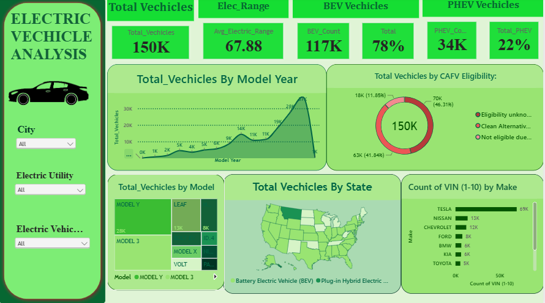

# ⚡ Electric Vehicle Population Analysis

An interactive Power BI dashboard for analyzing the electric vehicle (EV) population: vehicle counts, BEV vs PHEV split, model-year trends, top makes and models, clean-fuel eligibility, electric range, and geographic distribution.


---
## 🖼️ Dashboard Preview



---

## 📌 Project Overview

**Electric Vehicle Population Analysis** is an end-to-end Power BI project that turns a registered-EV dataset of **150,457 vehicles** into a single-page, interactive business intelligence dashboard.

It is designed for analysts, policy makers, and EV-industry teams who want to understand:

- How many electric vehicles are registered
- How the fleet splits between Battery Electric (BEV) and Plug-in Hybrid (PHEV) vehicles
- How EV adoption has grown by model year
- Which makes and models dominate the market
- How many vehicles qualify for Clean Alternative Fuel Vehicle (CAFV) benefits
- What the typical electric range is
- Where vehicles are concentrated by state, city, and electric utility

---

## 🎯 Project Objectives

1. Measure the size and composition of the EV population.
2. Compare BEV and PHEV adoption.
3. Track EV growth across model years.
4. Identify the leading makes and models.
5. Analyze CAFV eligibility across the fleet.
6. Understand electric range performance.
7. Enable filtering by city, electric utility, and vehicle type.

---

## 🧰 Tools & Technologies

| Tool / Technology | Purpose |
|---|---|
| **Microsoft Power BI** | Dashboard development and interactive reporting |
| **Power Query** | Data cleaning and transformation |
| **DAX** | Measures, KPIs, and calculations |
| **CSV dataset** | Source data |
| **GitHub** | Documentation and version control |

---

## 🖥️ Dashboard Overview

The report is a single interactive page with a slicer sidebar, KPI cards, and five analytical visuals.

### KPI Cards
| KPI | Description |
|---|---|
| **Total Vehicles** | Total registered EVs (~150K) |
| **Avg Electric Range** | Average electric range in miles (67.88) |
| **BEV Count / %** | Battery Electric Vehicles (~117K, 78%) |
| **PHEV Count / %** | Plug-in Hybrid Electric Vehicles (~34K, 22%) |

### Visuals
- 📈 **Total Vehicles by Model Year:** area chart showing EV growth over time.
- 🍩 **Total Vehicles by CAFV Eligibility:** donut chart splitting eligible, not eligible, and unknown.
- 🧩 **Total Vehicles by Model:** treemap of the most common models (Model Y, Model 3, Leaf, and more).
- 🗺️ **Total Vehicles by State:** filled map, split by vehicle type.
- 🏭 **Count by Make (Top 10):** bar chart of leading manufacturers.

### Slicers
Filter the whole dashboard by **City**, **Electric Utility**, and **Electric Vehicle Type**.

### Business Questions Answered
- How many EVs are on the road, and what share is fully electric?
- In which model years did EV registrations grow fastest?
- Which make and model lead the market?
- What share of vehicles is eligible for clean-fuel benefits?
- What is the average electric range?
- Which cities and utilities serve the most EVs?

---

## 📁 Dataset

The dataset contains **150,457 records** and **17 columns**, covering model years **1997 to 2024**, **37 makes**, **127 models**, **682 cities**, **183 counties**, and **76 electric utilities**.

| Group | Fields |
|---|---|
| **Vehicle** | VIN (1-10), DOL Vehicle ID, Model Year, Make, Model, Electric Vehicle Type |
| **Performance & eligibility** | Electric Range, Base MSRP, CAFV Eligibility |
| **Location** | County, City, State, Postal Code, Legislative District, Vehicle Location, 2020 Census Tract |
| **Utility** | Electric Utility |

**Source:**  Kaggle

### Data notes
- **Mostly one state:** about 99.8% of records are in Washington (WA), so the state map is concentrated there.
- **Electric Range = 0 means "not researched":** 69,681 records (46.3%) have a range of 0 because the battery range has not been researched. These match the "Eligibility unknown" group. The 67.88-mile average includes them; for vehicles with a known range the average is about **126 miles**.
- **VIN (1-10) is a partial VIN** and repeats across vehicles, so vehicle counts are record counts. `DOL Vehicle ID` is the unique identifier.
- **Model Year 2024 is incomplete** (only 642 records), so the last point on the trend line drops.
- Only a small number of columns have missing values (County, City, Postal Code, Legislative District, Vehicle Location, Electric Utility, Census Tract).

---

## 🧹 Data Preparation

- Reviewed the schema and data types
- Checked missing values and duplicate identifiers
- Kept valid records instead of deleting rows with blank non-critical fields
- Standardized fields used in visuals (make, model, city, eligibility)
- Created DAX measures for KPIs
- Validated KPI totals against the source data

---

## 🧮 DAX Measures

**Total Vehicles**
```DAX
Total Vehicles =
COUNTROWS ( 'EV Data' )
```

**BEV Count**
```DAX
BEV Count =
CALCULATE (
    [Total Vehicles],
    'EV Data'[Electric Vehicle Type] = "Battery Electric Vehicle (BEV)"
)
```

**BEV %**
```DAX
BEV % =
DIVIDE ( [BEV Count], [Total Vehicles], 0 )
```

**Avg Electric Range**
```DAX
Avg Electric Range =
AVERAGE ( 'EV Data'[Electric Range] )
```

---

## 💡 Key Insights

- The dataset holds **150,457 EVs**: **77.6% BEV** (116,784) and **22.4% PHEV** (33,673).
- EV registrations peak at **model year 2023 (37,071 vehicles)**. Model years 2020–2023 make up about **63%** of the fleet.
- **Tesla** leads with **68,970 vehicles (about 46%)**. Tesla, Nissan, and Chevrolet together account for about **63%**.
- **Model Y (28,495)** and **Model 3 (27,705)** are the top models, followed by **Nissan Leaf (13,186)**.
- For CAFV eligibility, **46.3%** is unknown (range not researched), **41.8%** is eligible, and **11.9%** is not eligible due to low battery range.
- **Seattle (25,671)**, **Bellevue (7,691)**, and **Redmond (5,502)** have the most vehicles.

> These observations describe the dataset analyzed. They are not forecasts or causal conclusions.

---

## 🔄 Interactive Features

- Slicers for City, Electric Utility, and Vehicle Type
- Cross-filtering between all visuals
- KPI cards that respond to filters
- Area, donut, treemap, filled-map, and bar visuals

---

## 📁 Repository Structure

```
Electric-Vehicle-Population-Analysis/
│
├── README.md
├── EV_Dashboard.png
├── Electric_Vehicle_Analysis.pbix
└── data/
    └── Electric_Vehicle_Population_Data.zip
```

---

## 🚀 How to Use

1. **Clone or download** the repository.
2. Open the `PB3.pbix` file in **Microsoft Power BI Desktop**.
3. If the file path is different, go to **Home → Transform data → Data source settings** and update the source.
4. Click **Home → Refresh**.
5. Use the slicers to explore the data.

---

## 🔮 Future Improvements

- Add a county or city-level map
- Add range-by-make and range-by-year analysis
- Handle "range not researched" records separately
- Add a growth-rate (year-over-year) measure
- Add a second page for utility and location analysis
- Publish to Power BI Service with scheduled refresh

---

## 🧠 Skills Demonstrated

Power BI • Power Query • DAX • Data Cleaning • KPI Development • Business Intelligence • Data Visualization • Dashboard Design • Exploratory Data Analysis • Data Storytelling

---

## 👨‍💻 Project Type

**Portfolio Project — Business Intelligence / Data Analytics**

| | |
|---|---|
| **Project Name** | Electric Vehicle Population Analysis |
| **Domain** | Electric Mobility / Automotive Analytics |
| **Primary Tool** | Microsoft Power BI |

---

## ⭐ Final Summary

Electric Vehicle Population Analysis converts a 150K-record EV registration dataset into an interactive Power BI dashboard covering fleet size, BEV vs PHEV mix, model-year growth, leading makes and models, clean-fuel eligibility, and electric range.

---

## 👤 Author

**Jagadeeswary.T**

[LinkedIn](https://www.linkedin.com/in/jaga-t0906) | [GitHub](https://github.com/Jagadeeswary) | [Email](mailto:your-email@gmail.com)
